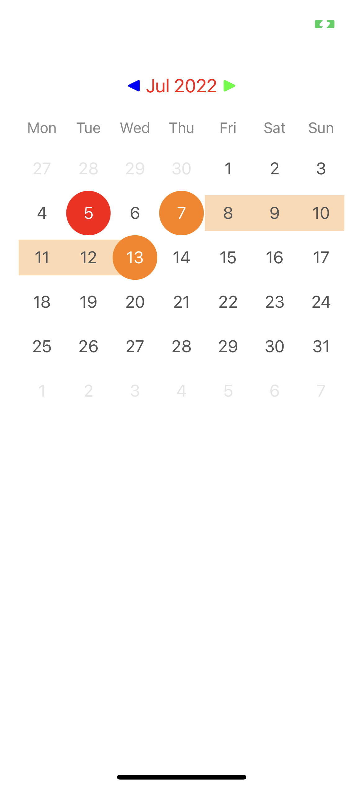
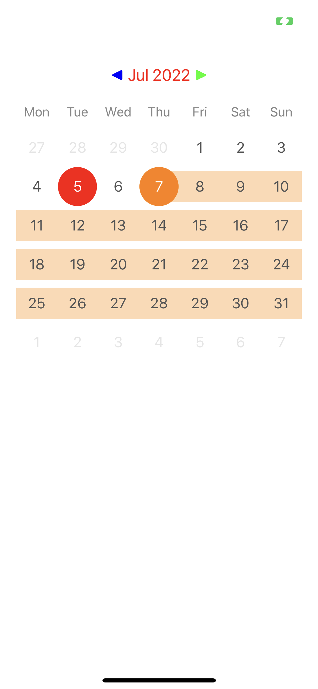
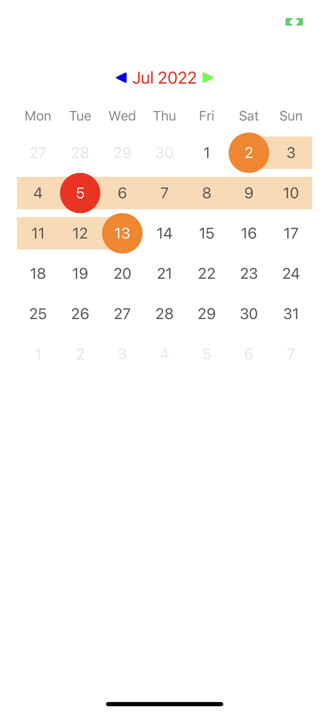

# CalendarRangeView





## Installation

CalendarRangeView is available through [CocoaPods](http://cocoapods.org). To install
it, simply add the following line to your Podfile:

```ruby
pod "CalendarRangeView"
```

If you used `use_framework` in your podfile just simply do:

```Swift
import CalendarRangeView

```

for every file when you need to use it.

you may also use:

```Swift
@import CalendarRangeView

```

within **bridging header** file and avoid to import framework for every needed file.


## Info

- entirely written in latest Swift syntax.

## Usage

```Swift
    let calendarView: CalendarView = {
        let view = CalendarView()
        view.headerBackgroundColor = .white
        view.headerTitleFont = UIFont.poppinsRegular.withSize(18)
        view.headerTitleColor = .mineShaft
        view.previousButtonTitleColor = .blueChill
        view.nextButtonTitleColor = .blueChill
        view.highlightColor = .blueChill
        view.monthRange = 600
        view.font = .poppinsRegular
        return view
    }()

    let date = Date()
    calendarView.maxDate = date.addingTimeInterval(24 * 60 * 60 * 50)
    calendarView.startDate = date.addingTimeInterval(24 * 60 * 60 * 2)
    calendarView.endDate = date.addingTimeInterval(24 * 60 * 60 * 8)
    calendarView.reloadData()
```

##### You may receive callback from library using the following delegate method:

```Swift
    // MARK: - CalendarViewDelegate

    func didSelectDate(startDate: Date, endDate: Date?) {
        // manage your start and/or end date
    }
```


## Author

Bartłomiej Semańczyk, bartekss2@icloud.com

## License

CalendarRangeView is available under the MIT license. See the LICENSE file for more info.